# Genentech Cervical Cancer Screening - Insights

- https://www.kaggle.com/c/cervical-cancer-screening/

Cervical cancer is the third most common cancer in women worldwide,
affecting over 500,000 women and resulting in approximately 275,000
deaths every year. Most women in the US have access to cervical cancer
screening, yet 4,000 women die every year from cervical cancer in the
US and it is estimated that 30% of US women do not receive regular pap
screenings.

Prior research suggests that lower screening rates are associated with
low income, low education, lack of interaction with the healthcare
system, and lack of health insurance. But research also shows that
even in women with access to healthcare fail to get this preventive
test, indicating that barriers like lack of education and not being
comfortable with the procedure are influencing their behavior.

If one could better identify women who are not being screened,
education campaigns could target them with content that speaks
directly to their unique risk factors. Identifying predictors of not
receiving pap smears will provide important information to
stakeholders in cervical cancer prevention who run awareness programs.

### The goal is to predict which women will not be screened for cervical cancer on the recommended schedule.

Below is one analysis for the
[Kaggle Genentech Cervical Cancer Screening](https://www.kaggle.com/c/cervical-cancer-screening/)
competition.  A description of the model can be found in the [wiki]()
and supporting files can be found in this
[github repo](https://github.com/paulperry/kaggle-cervical-cancer-screening).

- By Paul Perry, Elena Cuoco, and Zygmunt Zając.


## Overall screening percentage

The average screening of patients overall is 55%:  0.557785

## Screening by Age, Ethnicity, Household income, and Education level

At a high level, younger patients have a higher likelihood of being
screened, and while a higher household income has a higher likelihood
of being screened, ethnicity and education level are not
distinguishing features at the overall aggregate level.

Percentage screened by age group
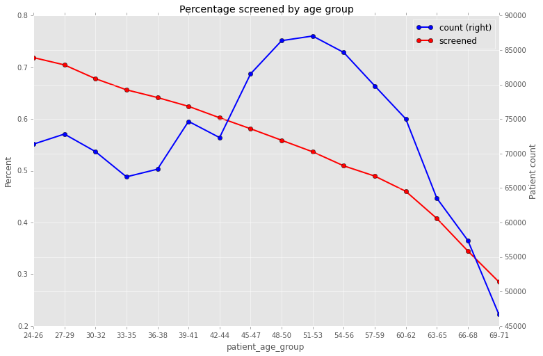

Screen percentages by ethnicity, household income, and education level:

Screened by Ethnicity and Age
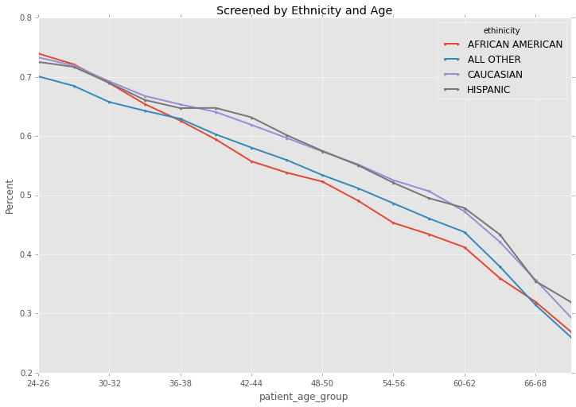

Number of Patients by Ethnicity and Age
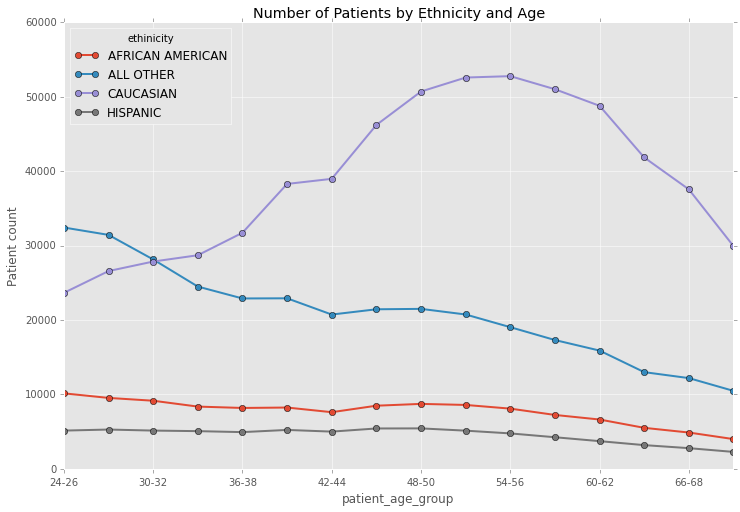

Screened by Household Income and Age
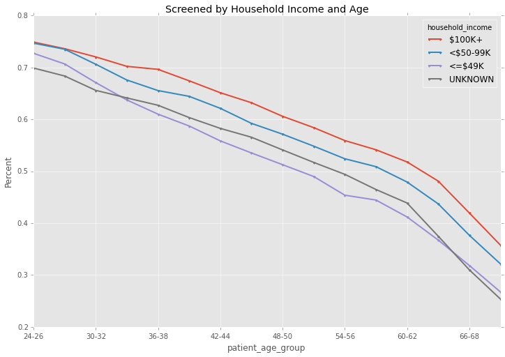

Number of Patients by Household Income and Age
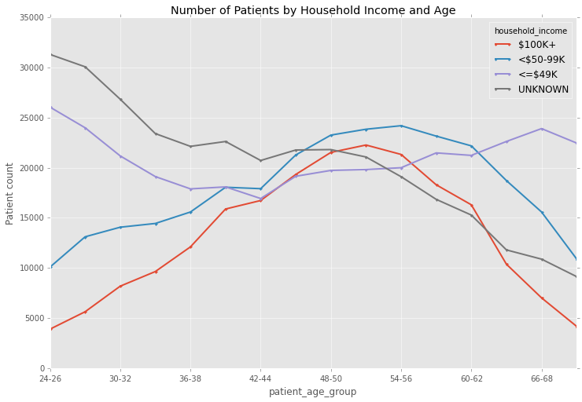

Screened by Education Level and Age
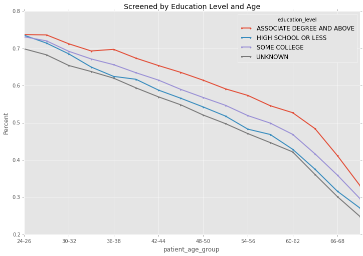

Number of Patients by Education Level and Age
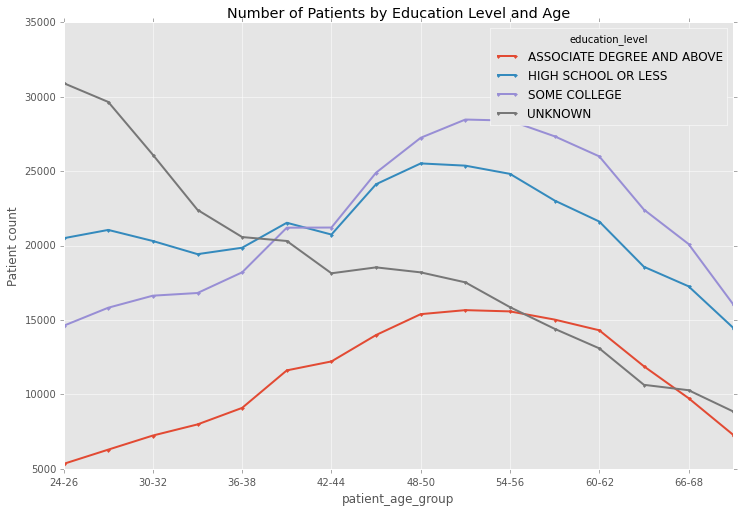

## Screening by Diagnosis

The data has patient demographic information, and diagnosis,
procedures and surgeries for each patient.  A diagnosis precedes any
procedure or surgery, and we can identify which diagnosis are more
predictive of screening patients.  In our
[model](https://github.com/paulperry/kaggle-cervical-cancer-screening/wiki)
we performed an L1 Lasso regression for all diagnosis with
[VW](https://github.com/JohnLangford/vowpal_wabbit/wiki) and have a
ranking of importance for each diagnosis that has a support of more
than 100 patients. Here we list the top 20:

<div>
<table border="1" class="dataframe">
  <thead>
    <tr style="text-align: right;">
      <th></th>
      <th>HashVal</th>
      <th>MinVal</th>
      <th>MaxVal</th>
      <th>Weight</th>
      <th>RelScore</th>
      <th>diagnosis_description</th>
    </tr>
    <tr>
      <th>FeatureName</th>
      <th></th>
      <th></th>
      <th></th>
      <th></th>
      <th></th>
      <th></th>
    </tr>
  </thead>
  <tbody>
    <tr>
      <th>200.52</th>
      <td>34931848</td>
      <td>0</td>
      <td>107</td>
      <td>+0.4335</td>
      <td>35.34</td>
      <td>PRIMARY CENTRAL NERVOUS SYSTEM LYMPHOMA, INTRA...</td>
    </tr>
    <tr>
      <th>952.17</th>
      <td>107180186</td>
      <td>0</td>
      <td>158</td>
      <td>+0.2046</td>
      <td>16.68</td>
      <td>T7-T12 LEVEL WITH ANTERIOR CORD SYNDROME</td>
    </tr>
    <tr>
      <th>E819.4</th>
      <td>69246957</td>
      <td>0</td>
      <td>109</td>
      <td>+0.0719</td>
      <td>5.86</td>
      <td>MOTOR VEHICLE TRAFFIC ACCIDENT OF UNSPECIFIED ...</td>
    </tr>
    <tr>
      <th>V70.0</th>
      <td>28629103</td>
      <td>0</td>
      <td>150</td>
      <td>+0.0480</td>
      <td>3.91</td>
      <td>ROUTINE GENERAL MEDICAL EXAMINATION AT A HEALT...</td>
    </tr>
    <tr>
      <th>V72.69</th>
      <td>7517362</td>
      <td>0</td>
      <td>146</td>
      <td>+0.0381</td>
      <td>3.11</td>
      <td>OTHER LABORATORY EXAMINATION</td>
    </tr>
    <tr>
      <th>627.3</th>
      <td>12063493</td>
      <td>0</td>
      <td>114</td>
      <td>+0.0341</td>
      <td>2.78</td>
      <td>POSTMENOPAUSAL ATROPHIC VAGINITIS</td>
    </tr>
    <tr>
      <th>533.30</th>
      <td>22307620</td>
      <td>0</td>
      <td>141</td>
      <td>+0.0334</td>
      <td>2.72</td>
      <td>ACUTE PEPTIC ULCER OF UNSPECIFIED SITE WITHOUT...</td>
    </tr>
    <tr>
      <th>339.41</th>
      <td>90070467</td>
      <td>0</td>
      <td>129</td>
      <td>+0.0284</td>
      <td>2.31</td>
      <td>HEMICRANIA CONTINUA</td>
    </tr>
    <tr>
      <th>V70.9</th>
      <td>17974393</td>
      <td>0</td>
      <td>181</td>
      <td>+0.0251</td>
      <td>2.04</td>
      <td>UNSPECIFIED GENERAL MEDICAL EXAMINATION</td>
    </tr>
    <tr>
      <th>V22.1</th>
      <td>36121193</td>
      <td>0</td>
      <td>158</td>
      <td>+0.0243</td>
      <td>1.98</td>
      <td>SUPERVISION OF OTHER NORMAL PREGNANCY</td>
    </tr>
    <tr>
      <th>V72.6</th>
      <td>8072748</td>
      <td>0</td>
      <td>319</td>
      <td>+0.0222</td>
      <td>1.81</td>
      <td>LABORATORY EXAMINATION</td>
    </tr>
    <tr>
      <th>173.10</th>
      <td>87838925</td>
      <td>0</td>
      <td>140</td>
      <td>+0.0201</td>
      <td>1.64</td>
      <td>UNSPECIFIED MALIGNANT NEOPLASM OF EYELID, INCL...</td>
    </tr>
    <tr>
      <th>781.6</th>
      <td>107268904</td>
      <td>0</td>
      <td>127</td>
      <td>+0.0200</td>
      <td>1.63</td>
      <td>MENINGISMUS</td>
    </tr>
    <tr>
      <th>192.9</th>
      <td>20608283</td>
      <td>0</td>
      <td>283</td>
      <td>+0.0186</td>
      <td>1.51</td>
      <td>MALIGNANT NEOPLASM OF NERVOUS SYSTEM, PART UNS...</td>
    </tr>
    <tr>
      <th>616.10</th>
      <td>16044104</td>
      <td>0</td>
      <td>116</td>
      <td>+0.0182</td>
      <td>1.49</td>
      <td>VAGINITIS AND VULVOVAGINITIS, UNSPECIFIED</td>
    </tr>
    <tr>
      <th>626.4</th>
      <td>105109201</td>
      <td>0</td>
      <td>227</td>
      <td>+0.0168</td>
      <td>1.37</td>
      <td>IRREGULAR MENSTRUAL CYCLE</td>
    </tr>
    <tr>
      <th>V67.9</th>
      <td>120446415</td>
      <td>0</td>
      <td>105</td>
      <td>+0.0155</td>
      <td>1.26</td>
      <td>UNSPECIFIED FOLLOW-UP EXAMINATION</td>
    </tr>
    <tr>
      <th>230.4</th>
      <td>36208803</td>
      <td>0</td>
      <td>160</td>
      <td>+0.0139</td>
      <td>1.13</td>
      <td>CARCINOMA IN SITU OF RECTUM</td>
    </tr>
    <tr>
      <th>V72.60</th>
      <td>65841130</td>
      <td>0</td>
      <td>255</td>
      <td>+0.0133</td>
      <td>1.09</td>
      <td>LABORATORY EXAMINATION, UNSPECIFIED</td>
    </tr>
    <tr>
      <th>V22.2</th>
      <td>133676338</td>
      <td>0</td>
      <td>116</td>
      <td>+0.0125</td>
      <td>1.02</td>
      <td>PREGNANT STATE, INCIDENTAL</td>
    </tr>
  </tbody>
</table>
</div>


And the bottom 20:

<div>
<table border="1" class="dataframe">
  <thead>
    <tr style="text-align: right;">
      <th></th>
      <th>HashVal</th>
      <th>MinVal</th>
      <th>MaxVal</th>
      <th>Weight</th>
      <th>RelScore</th>
      <th>diagnosis_description</th>
    </tr>
    <tr>
      <th>FeatureName</th>
      <th></th>
      <th></th>
      <th></th>
      <th></th>
      <th></th>
      <th></th>
    </tr>
  </thead>
  <tbody>
    <tr>
      <th>786.4</th>
      <td>27883072</td>
      <td>0</td>
      <td>115</td>
      <td>-0.0138</td>
      <td>-1.13</td>
      <td>ABNORMAL SPUTUM</td>
    </tr>
    <tr>
      <th>V07.4</th>
      <td>10871442</td>
      <td>0</td>
      <td>122</td>
      <td>-0.0150</td>
      <td>-1.22</td>
      <td>HORMONE REPLACEMENT THERAPY (POSTMENOPAUSAL)</td>
    </tr>
    <tr>
      <th>751.69</th>
      <td>14358211</td>
      <td>0</td>
      <td>124</td>
      <td>-0.0155</td>
      <td>-1.27</td>
      <td>OTHER CONGENITAL ANOMALIES OF GALLBLADDER, BIL...</td>
    </tr>
    <tr>
      <th>478.33</th>
      <td>18712882</td>
      <td>0</td>
      <td>103</td>
      <td>-0.0159</td>
      <td>-1.29</td>
      <td>PARTIAL BILATERAL PARALYSIS OF VOCAL CORDS</td>
    </tr>
    <tr>
      <th>349.9</th>
      <td>127345017</td>
      <td>0</td>
      <td>129</td>
      <td>-0.0160</td>
      <td>-1.30</td>
      <td>UNSPECIFIED DISORDERS OF NERVOUS SYSTEM</td>
    </tr>
    <tr>
      <th>346.93</th>
      <td>51552015</td>
      <td>0</td>
      <td>146</td>
      <td>-0.0165</td>
      <td>-1.34</td>
      <td>MIGRAINE, UNSPECIFIED, WITH INTRACTABLE MIGRAI...</td>
    </tr>
    <tr>
      <th>172.2</th>
      <td>67795698</td>
      <td>0</td>
      <td>117</td>
      <td>-0.0170</td>
      <td>-1.39</td>
      <td>MALIGNANT MELANOMA OF SKIN OF EAR AND EXTERNAL...</td>
    </tr>
    <tr>
      <th>V66.0</th>
      <td>99523275</td>
      <td>0</td>
      <td>157</td>
      <td>-0.0179</td>
      <td>-1.46</td>
      <td>CONVALESCENCE FOLLOWING SURGERY</td>
    </tr>
    <tr>
      <th>797</th>
      <td>20109692</td>
      <td>0</td>
      <td>218</td>
      <td>-0.0180</td>
      <td>-1.47</td>
      <td>SENILITY WITHOUT MENTION OF PSYCHOSIS</td>
    </tr>
    <tr>
      <th>783.40</th>
      <td>53036792</td>
      <td>0</td>
      <td>150</td>
      <td>-0.0202</td>
      <td>-1.65</td>
      <td>LACK OF NORMAL PHYSIOLOGICAL DEVELOPMENT, UNSP...</td>
    </tr>
    <tr>
      <th>642.94</th>
      <td>49753452</td>
      <td>0</td>
      <td>151</td>
      <td>-0.0213</td>
      <td>-1.73</td>
      <td>UNSPECIFIED POSTPARTUM HYPERTENSION</td>
    </tr>
    <tr>
      <th>934.8</th>
      <td>2741089</td>
      <td>0</td>
      <td>154</td>
      <td>-0.0250</td>
      <td>-2.04</td>
      <td>FOREIGN BODY IN OTHER SPECIFIED PARTS BRONCHUS...</td>
    </tr>
    <tr>
      <th>997.41</th>
      <td>11576306</td>
      <td>0</td>
      <td>170</td>
      <td>-0.0317</td>
      <td>-2.59</td>
      <td>RETAINED CHOLELITHIASIS FOLLOWING CHOLECYSTECTOMY</td>
    </tr>
    <tr>
      <th>V88.01</th>
      <td>11839368</td>
      <td>0</td>
      <td>117</td>
      <td>-0.0457</td>
      <td>-3.73</td>
      <td>ACQUIRED ABSENCE OF BOTH CERVIX AND UTERUS</td>
    </tr>
    <tr>
      <th>126.9</th>
      <td>38080853</td>
      <td>0</td>
      <td>130</td>
      <td>-0.0471</td>
      <td>-3.84</td>
      <td>ANCYLOSTOMIASIS AND NECATORIASIS, UNSPECIFIED</td>
    </tr>
    <tr>
      <th>675.90</th>
      <td>11339609</td>
      <td>0</td>
      <td>131</td>
      <td>-0.0765</td>
      <td>-6.24</td>
      <td>UNSPECIFIED INFECTION OF THE BREAST AND NIPPLE...</td>
    </tr>
    <tr>
      <th>863.80</th>
      <td>108832538</td>
      <td>0</td>
      <td>118</td>
      <td>-0.1485</td>
      <td>-12.10</td>
      <td>INJURY TO GASTROINTESTINAL TRACT, UNSPECIFIED ...</td>
    </tr>
    <tr>
      <th>202.12</th>
      <td>129704</td>
      <td>0</td>
      <td>255</td>
      <td>-0.2031</td>
      <td>-16.55</td>
      <td>MYCOSIS FUNGOIDES INVOLVING INTRATHORACIC LYMP...</td>
    </tr>
    <tr>
      <th>854.1</th>
      <td>1643935</td>
      <td>0</td>
      <td>171</td>
      <td>-0.2206</td>
      <td>-17.98</td>
      <td>INTRACRANIAL INJURY OF OTHER AND UNSPECIFIED N...</td>
    </tr>
    <tr>
      <th>012.04</th>
      <td>33772955</td>
      <td>0</td>
      <td>197</td>
      <td>-0.3278</td>
      <td>-26.73</td>
      <td>TUBERCULOUS PLEURISY, TUBERCLE BACILLI NOT FOU...</td>
    </tr>
  </tbody>
</table>
</div>


If we look at all diagnosis and rank by count descenging:

<div>
<table border="1" class="dataframe">
  <thead>
    <tr style="text-align: right;">
      <th></th>
      <th>count</th>
      <th>diagnosis_description</th>
    </tr>
    <tr>
      <th>diagnosis_code</th>
      <th></th>
      <th></th>
    </tr>
  </thead>
  <tbody>
    <tr>
      <th>V72.31</th>
      <td>1603813</td>
      <td>ROUTINE GYNECOLOGICAL EXAMINATION</td>
    </tr>
    <tr>
      <th>V76.12</th>
      <td>1575791</td>
      <td>OTHER SCREENING MAMMOGRAM</td>
    </tr>
    <tr>
      <th>401.9</th>
      <td>1258095</td>
      <td>UNSPECIFIED ESSENTIAL HYPERTENSION</td>
    </tr>
    <tr>
      <th>729.5</th>
      <td>1192658</td>
      <td>PAIN IN LIMB</td>
    </tr>
    <tr>
      <th>780.79</th>
      <td>1167895</td>
      <td>OTHER MALAISE AND FATIGUE</td>
    </tr>
    <tr>
      <th>V70.0</th>
      <td>1167207</td>
      <td>ROUTINE GENERAL MEDICAL EXAMINATION AT A HEALT...</td>
    </tr>
    <tr>
      <th>789.00</th>
      <td>1136609</td>
      <td>ABDOMINAL PAIN, UNSPECIFIED SITE</td>
    </tr>
    <tr>
      <th>272.4</th>
      <td>1124718</td>
      <td>OTHER AND UNSPECIFIED HYPERLIPIDEMIA</td>
    </tr>
    <tr>
      <th>786.50</th>
      <td>1079385</td>
      <td>UNSPECIFIED CHEST PAIN</td>
    </tr>
    <tr>
      <th>724.2</th>
      <td>1040962</td>
      <td>LUMBAGO</td>
    </tr>
    <tr>
      <th>599.0</th>
      <td>1035689</td>
      <td>URINARY TRACT INFECTION, SITE NOT SPECIFIED</td>
    </tr>
    <tr>
      <th>786.2</th>
      <td>995899</td>
      <td>COUGH</td>
    </tr>
    <tr>
      <th>V58.69</th>
      <td>995756</td>
      <td>LONG-TERM (CURRENT) USE OF OTHER MEDICATIONS</td>
    </tr>
    <tr>
      <th>784.0</th>
      <td>972514</td>
      <td>HEADACHE</td>
    </tr>
    <tr>
      <th>530.81</th>
      <td>963399</td>
      <td>ESOPHAGEAL REFLUX</td>
    </tr>
    <tr>
      <th>V04.81</th>
      <td>907575</td>
      <td>NEED FOR PROPHYLACTIC VACCINATION AND INOCULAT...</td>
    </tr>
    <tr>
      <th>311</th>
      <td>793025</td>
      <td>DEPRESSIVE DISORDER, NOT ELSEWHERE CLASSIFIED</td>
    </tr>
    <tr>
      <th>724.5</th>
      <td>787452</td>
      <td>BACKACHE, UNSPECIFIED</td>
    </tr>
    <tr>
      <th>401.1</th>
      <td>785275</td>
      <td>BENIGN ESSENTIAL HYPERTENSION</td>
    </tr>
    <tr>
      <th>465.9</th>
      <td>779717</td>
      <td>ACUTE UPPER RESPIRATORY INFECTIONS OF UNSPECIF...</td>
    </tr>
  </tbody>
</table>
</div>


We notice that the most common diagnosis_code's are V7* codes, routine
exams of one kind or another.

The **insight** is that these diagnosis can be grouped into:
1. diagnosis relating to routine or gynecological exams (V70.0, V7*.*, V72.31, etc)
- pregnancy (V22.2, V22.)
- gynecologyical (626.4, 616.10)
- or desease or severe injury (cancer, 200.52, 230.4, 172.2, 173.10, etc.) sometimes associated with age (797)

We examine each of these diagnosis groupings.

## Interaction with the Medical System: Patient had a Medical Exam

A number of features are a proxy for patient's level of interaction
with the medical system.  In our model, the number of visits (a count
from the patient_activity table), or num_procedures (count of all
procedures performed), are highly ranked features in an XGBoost model.

A key entry point to the medical system is an annual medical exam.  We
look at whether the patient has ever had medical exam ( diagnosis_code
in ('V70', 'V70.0', 'V70.1', 'V70.2', 'V70.3', 'V70.4', 'V70.5',
'V70.6', 'V70.7', 'V70.8', 'V70.9'), and calculate the likelihood of
screening for the patient.


There are 1,157,817 patients in the train set, of which, 498,157 have
had a medical exam during the entire 7 years of the data.

So less than half of the population has had a regular medical exam: 0.4302

But the average screening rate is 66% for patients who have had any medical exam: 0.6684

And only 47% if they never have had one: 0.474220

## Patient was referred to a Gynecological Exam

If the patient had one of these codes, then they may have been referred to a gynecological exam:
```
 diagnosis_code |  diagnosis_description                                                 
----------------+-----------------------------------
 V72.3          | GYNECOLOGICAL EXAMINATION
 V72.31         | ROUTINE GYNECOLOGICAL EXAMINATION
```

More than half the patients in this database have had a gynecological exam: 0.5603

And if they have had an exam then the likelihood that they have been screened is high: 0.8079

And quite low if they have not had a gynecological exam: 0.2389

We can look at the screening precentage and absolute patient counts
for patients that have had a medical exam and/or a gynecological exam

In percentages:
<div>
<table border="1" class="dataframe">
  <thead>
    <tr style="text-align: right;">
      <th></th>
      <th>Gyn Exam</th>
      <th>No Gyn Exam</th>
    </tr>
  </thead>
  <tbody>
    <tr>
      <th>Medical Exam</th>
      <td>0.857353</td>
      <td>0.336702</td>
    </tr>
    <tr>
      <th>No Medical Exam</th>
      <td>0.782578</td>
      <td>0.192350</td>
    </tr>
  </tbody>
</table>
</div>

Or actual counts:
<div>
<table border="1" class="dataframe">
  <thead>
    <tr style="text-align: right;">
      <th></th>
      <th>Gyn Exam</th>
      <th>No Gyn Exam</th>
    </tr>
  </thead>
  <tbody>
    <tr>
      <th>Medical Exam</th>
      <td>1104455</td>
      <td>164448</td>
    </tr>
    <tr>
      <th>No Medical Exam</th>
      <td>315028</td>
      <td>344632</td>
    </tr>
  </tbody>
</table>
</div>


Looking at each of the demographics separately, at the aggregate
level, for the patients that did **not** have a medical exam or a
gynecological exam, we don't see any trends other than younger
patients are more likely to be screened:


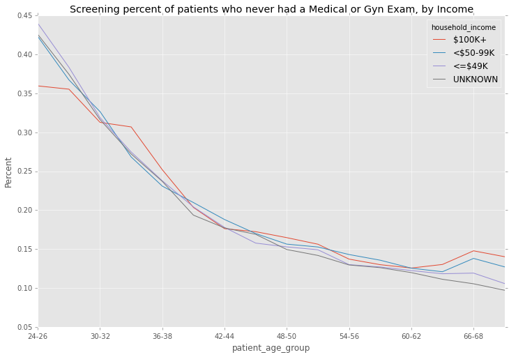


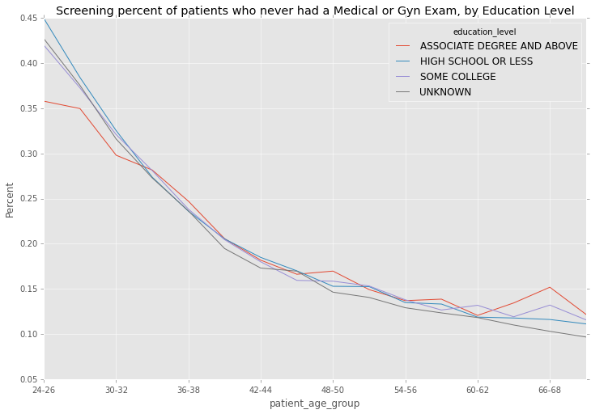


## Where are the patients that have never had a medical exam?


<div>
<table border="1" class="dataframe">
  <thead>
    <tr style="text-align: right;">
      <th></th>
      <th>NAME</th>
      <th>is_screener</th>
    </tr>
    <tr>
      <th>GEOID</th>
      <th></th>
      <th></th>
    </tr>
  </thead>
  <tbody>
    <tr>
      <th>22520</th>
      <td>Florence-Muscle Shoals, AL</td>
      <td>0.026480</td>
    </tr>
    <tr>
      <th>47220</th>
      <td>Vineland-Bridgeton, NJ</td>
      <td>0.027778</td>
    </tr>
    <tr>
      <th>13980</th>
      <td>Blacksburg-Christiansburg-Radford, VA</td>
      <td>0.029412</td>
    </tr>
    <tr>
      <th>17340</th>
      <td>Clearlake, CA</td>
      <td>0.033333</td>
    </tr>
    <tr>
      <th>40080</th>
      <td>Richmond-Berea, KY</td>
      <td>0.037037</td>
    </tr>
    <tr>
      <th>22700</th>
      <td>Fort Dodge, IA</td>
      <td>0.041667</td>
    </tr>
    <tr>
      <th>20940</th>
      <td>El Centro, CA</td>
      <td>0.041667</td>
    </tr>
    <tr>
      <th>26540</th>
      <td>Huntington, IN</td>
      <td>0.043478</td>
    </tr>
    <tr>
      <th>43300</th>
      <td>Sherman-Denison, TX</td>
      <td>0.048780</td>
    </tr>
    <tr>
      <th>22800</th>
      <td>Fort Madison-Keokuk, IA-IL-MO</td>
      <td>0.049020</td>
    </tr>
  </tbody>
</table>
</div>


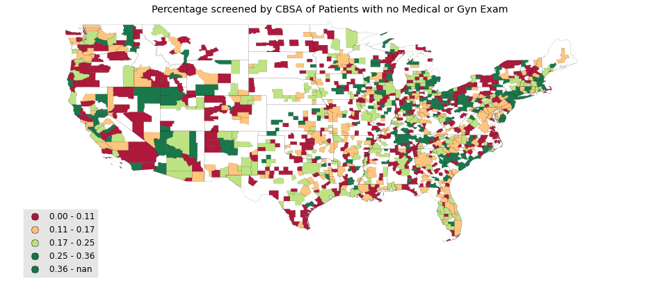


## Patient was pregnant or related

Our models showed the following diagnosis were strong predictors of being screened:
- 646.83 	OTHER SPECIFIED ANTEPARTUM COMPLICATIONS		
- 648.93 	OTHER CURRENT CONDITIONS CLASSIFIABLE ELSEWHERE OF MOTHER, ANTEPARTUM		
- 650	    NORMAL DELIVERY		
- V22.0 	SUPERVISION OF NORMAL FIRST PREGNANCY
- V22.1 	SUPERVISION OF OTHER NORMAL PREGNANCY
- V22.2 	PREGNANT STATE, INCIDENTAL
- V24.2 	ROUTINE POSTPARTUM FOLLOW-UP
- V25.2 	STERILIZATION
- V27.0 	MOTHER WITH SINGLE LIVEBORN
- V28.3 	ENCOUNTER FOR ROUTINE SCREENING FOR MALFORMATION USING ULTRASONICS
- V74.5 	SCREENING EXAMINATION FOR VENEREAL DISEASE

Patients who had one of the above diagnosis were screened with the following likelihood: 0.683994

And those that were not: 0.408647

Looking at these pregnancy diagnosis by demographics:


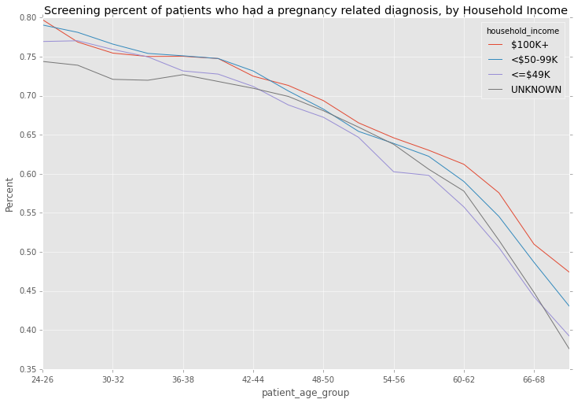


Versus the patients who has no such diagnosis:


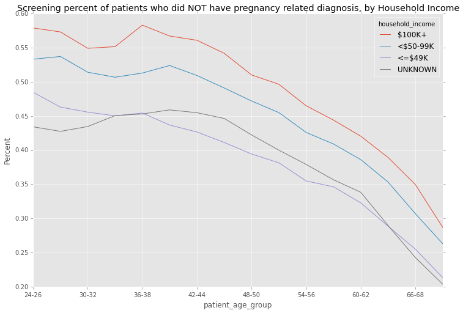


Again, by ethnicity, for patients that had such diagnosis:


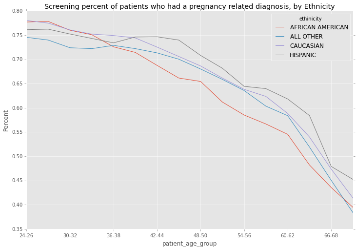


And those patients that had no such diagnosis:


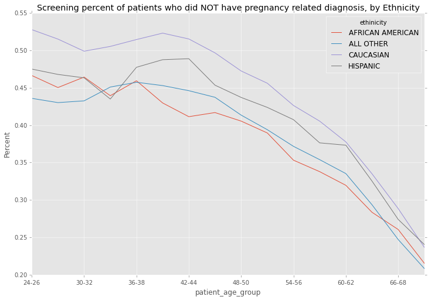


## Patient has other highly predictive diagnosis

Our modelling revealed the following diagnosis were also highly
predictive of screening, and the same analysis as above could be
performed, but these diagnosis look like the patient is already down a
path that required that they be screened, but we are looking for
patients that are not being screened.

- 462	ACUTE PHARYNGITIS		
- 496	CHRONIC AIRWAY OBSTRUCTION, NOT ELSEWHERE CLASSIFIED		
- 585.3	CHRONIC KIDNEY DISEASE, STAGE III (MODERATE)		
- 616	CERVICITIS AND ENDOCERVICITIS		
- 616.1	VAGINITIS AND VULVOVAGINITIS, UNSPECIFIED		
- 620.2	OTHER AND UNSPECIFIED OVARIAN CYST		
- 622.1	DYSPLASIA OF CERVIX, UNSPECIFIED		
- 622.11	MILD DYSPLASIA OF CERVIX		
- 623.5	LEUKORRHEA, NOT SPECIFIED AS INFECTIVE		
- 625.3	DYSMENORRHEA		
- 625.9	UNSPECIFIED SYMPTOM ASSOCIATED WITH FEMALE GENITAL ORGANS		
- 626	ABSENCE OF MENSTRUATION		
- 626.2	EXCESSIVE OR FREQUENT MENSTRUATION		
- 626.4	IRREGULAR MENSTRUAL CYCLE		
- 626.8	OTHER DISORDERS OF MENSTRUATION AND OTHER ABNORMAL BLEEDING FROM FEMALE GENITAL				
- 795	ABNORMAL GLANDULAR PAPANICOLAOU SMEAR OF CERVIX		

## Patient had procedures predictive of not being screened

We found the following procedures positively correlated with a patient being screened:

```
procedure_code   procedure_description                            RelScore
57454            COLPOSCOPY CERVIX BX CERVIX & ENDOCRV CURRETAGE   100.00%
1252             GJB2 GENE ANALYSIS FULL GENE SEQUENCE              96.93%
57456            COLPOSCOPY CERVIX ENDOCERVICAL CURETTAGE           95.00%
57455            COLPOSCOPY CERVIX UPPR/ADJCNT VAGINA W/CERVIX BX   91.42%
S4020            IN VITRO FERTILIZATION PROCEDURE CANCELLED BEFOR   85.76%
S0605            DIGITAL RECTAL EXAMINATION, MALE, ANNUAL           83.64%
G0143            SCREENING CYTOPATHOLOGY, CERVICAL OR VAGINAL (AN   78.39%
90696            DTAP-IPV VACCINE CHILD 4-6 YRS FOR IM USE          76.98%
S4023            DONOR EGG CYCLE, INCOMPLETE, CASE RATE             76.67%
69710            IMPLTJ/RPLCMT EMGNT BONE CNDJ DEV TEMPORAL BONE    72.06%
```

and the following procedures negatively correlated:

```
procedure_code        procedure_description             RelScore
K0735  SKIN PROTECTION WHEELCHAIR SEAT CUSHION, ADJUSTA  -62.48%
34805  EVASC RPR AAA AORTO-UNIILIAC/AORTO-UNIFEM PROSTH  -64.68%
L5975  ALL LOWER EXTREMITY PROSTHESIS, COMBINATION SING  -65.39%
89321  SEMEN ANALYSIS SPERM PRESENCE&/MOTILITY SPRM      -65.51%
S9145  INSULIN PUMP INITIATION, INSTRUCTION IN INITIAL   -69.96%
00632  ANESTHESIA LUMBAR REGION LUMBAR SYMPATHECTOMY     -77.13%
27756  PRQ SKELETAL FIXATION TIBIAL SHAFT FRACTURE       -78.61%
3303F  AJCC CANCER STAGE IA, DOCUMENTED (ONC), (ML)      -82.77%
23675  CLTX SHOULDER DISLC W/SURG/ANTMCL NECK FX W/MANJ  -83.14%
Q4111  GAMMAGRAFT, PER SQUARE CENTIMETER                 -85.49%
```

It seems clear that a number of negatively correlated procedures
identify patients that have bigger problems than the need for a
cervical exam, and it is possible physicians have not recommended a
screening for these reasons.  Therefore the analysis above should be
rerun without these patients skewing the likelihood percentages.

## Where are the patients ?

We can review all slices of screener likelihoods by geography.

Looking at the likelyhood by state:

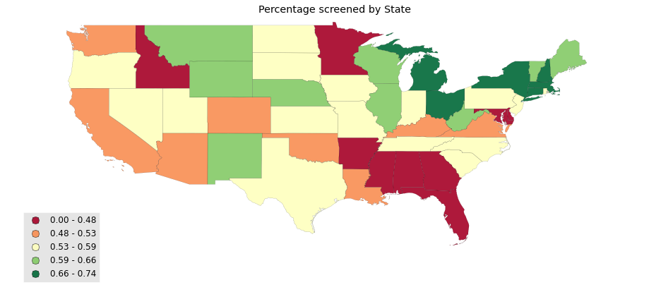


## By CBSA

Every patient was mapped to the
[CBSA](https://en.wikipedia.org/wiki/Core-based_statistical_area)
where they had the most diagnosis.  We can then look at the
likelihoods by these areas.  Combining this map as screened by the
features above would render a better map for targeting patients who
are not being screened.


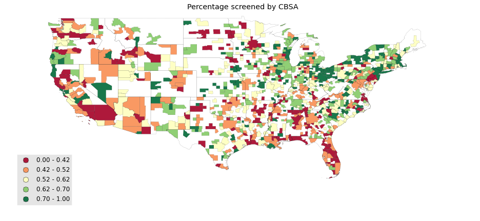


## Further Work

- The final goal is to remove the patients who are clearly too sick
  or invalid and focus on the remaining healthy patients and rank the
  CBSA's where an outreach campaign would have the most impact.  We
  are close but ran out of time.
- There are many physicians performing a routine gynecological exam
  that have a `specialty_code` other than `OBG` or `GYN`.  Looking
  into these differences by geography might be interesting.
- We have started to look at the percentage of screening by the
  `primary_practitioner` referring or performing the GYN exam and
  there are some stark differences.  Understanding these differences
  will help target the physicians rather than the patients.


