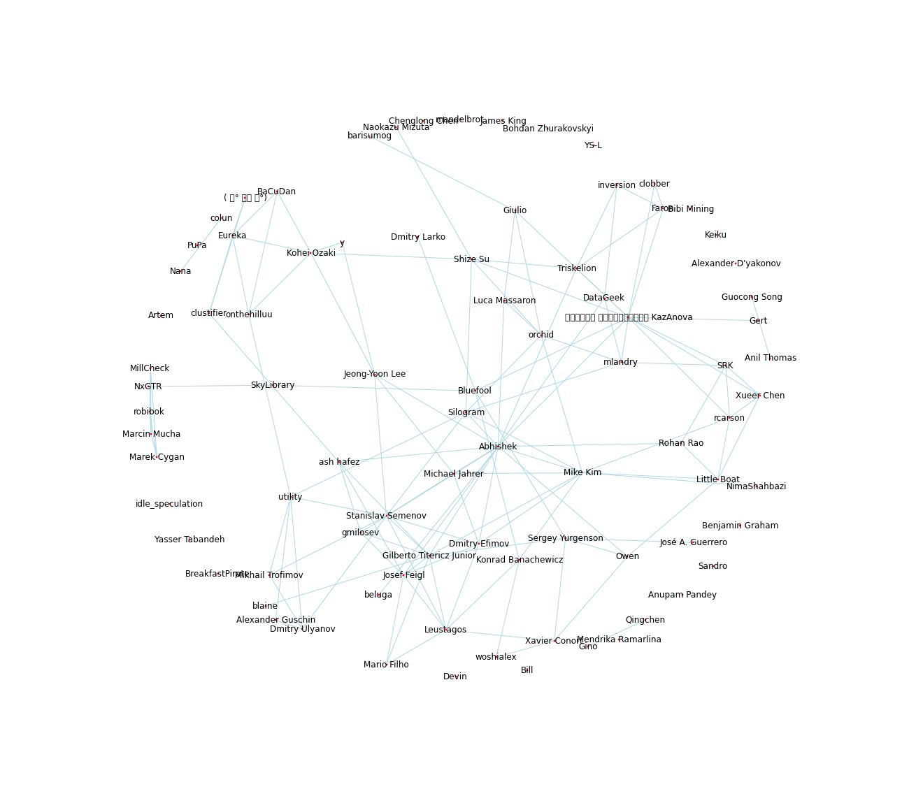

Kaggle Teams
============

This is a start at a quantitative and social network study of Kaggle
Teams.

There is a lot to learn from the top data science practitioners.  They
have dedicated a lot of time to develop their workflows, have great
intuition of what methods are likely to work, and are efficient in
their use of time.

The central question is: who do they choose to team with and how does
the team organize their work?

Data for this analysis comes from the Kaggle Leaderboard as of
February 17, 2016. The data was extracted by web-scraping Kaggle’s
leaderboard web pages. Source code for web-scraping and data
pre-processing can be found at
[Jim Thompson's](https://github.com/jimthompson5802)
[github repository](https://github.com/jimthompson5802/kaggle-RScript). This
analysis builds on previous analysis of Kaggle teams
[by country](https://www.kaggle.com/jimthompson/introducing-kaggle-scripts/kaggle-competition-medal-count-analysis),
[by team structure](https://www.kaggle.com/jimthompson/introducing-kaggle-scripts/visualizing-kaggle-team-structures),
[by profile](http://notesofdabbler.github.io/201412_exploreKaggle/exploreKaggleUsers.html),
and
[over time](https://www.kaggle.com/jeffhebert/d/kaggle/meta-kaggle/kaggle-competitions-over-time).
This analysis does not take advantage of the
[Meta-Kaggle](https://www.kaggle.com/kaggle/meta-kaggle) dataset yet.
As of February 17, 2016 there were 200 completed competitions. In this
study I focus this analysis on the 133 competitions with a cash prize
that had teams.

The questions I investigate are in the [kaggle_teams](https://github.com/paulperry/kaggle/tree/master/kaggle-teams/kaggle_teams.ipynb) notebook are:

1. How many kagglers joined teams?
- What is the distribution of team sizes?
- How many distict team names were there?
- Which competitions had the most teams?
- Which team name won the most competitions
- Which team members won the most when on a team?
- Which are the largest teams?
- Who has teamed up the most?
- What does the social graph look like?
- What are the skills of the top players?
- Do teams cluster based on skills?
- Do teams form based on language or country?
- Does participating on a team correlate with Kaggle rank?
- Do members team differently on structured vs unstructured data competitions?

<b>The Kaggle social graph of top players</b> 

