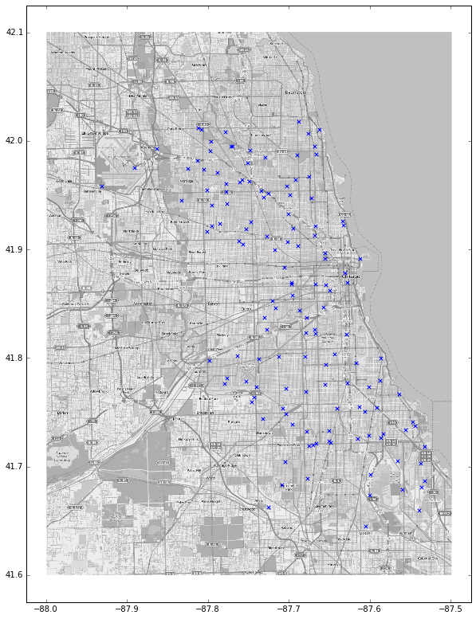

# predict west nile virus
- https://www.kaggle.com/c/predict-west-nile-virus
-------------

Given weather, location, testing, and spraying data, this competition
asks you to predict when and where different species of mosquitos will
test positive for West Nile virus in the Chicago area.

My winning model was a version of a Lasagne run with final ensemble
weights based on LB feeback, as suggested by <a
href='https://github.com/gaborfodor/WNVP'>gaborfodor</a>.

<b>Location of Mosquito Traps</b> 
 

