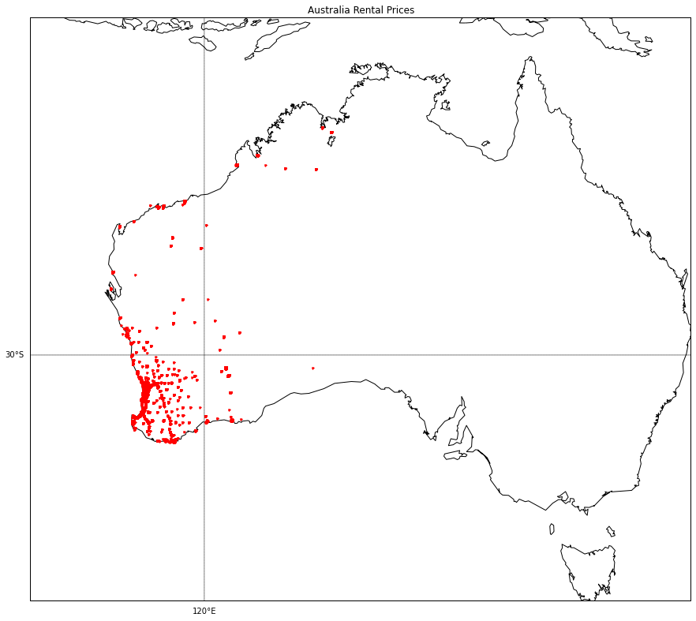
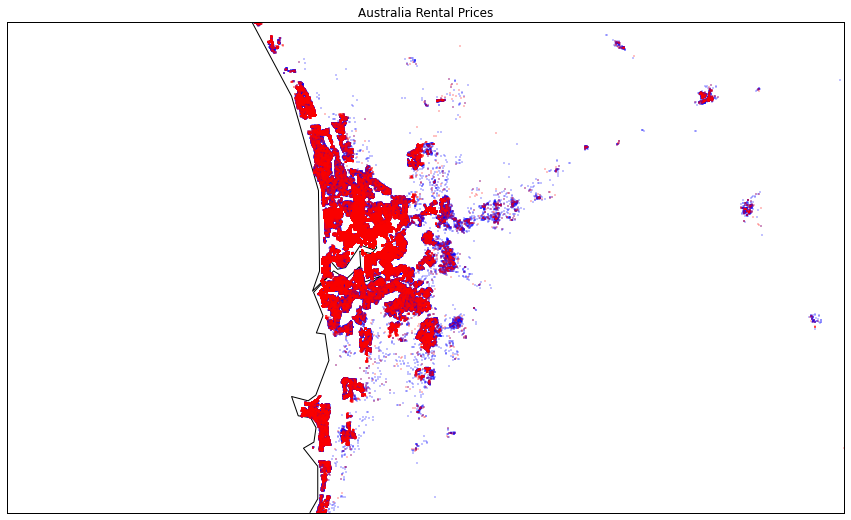
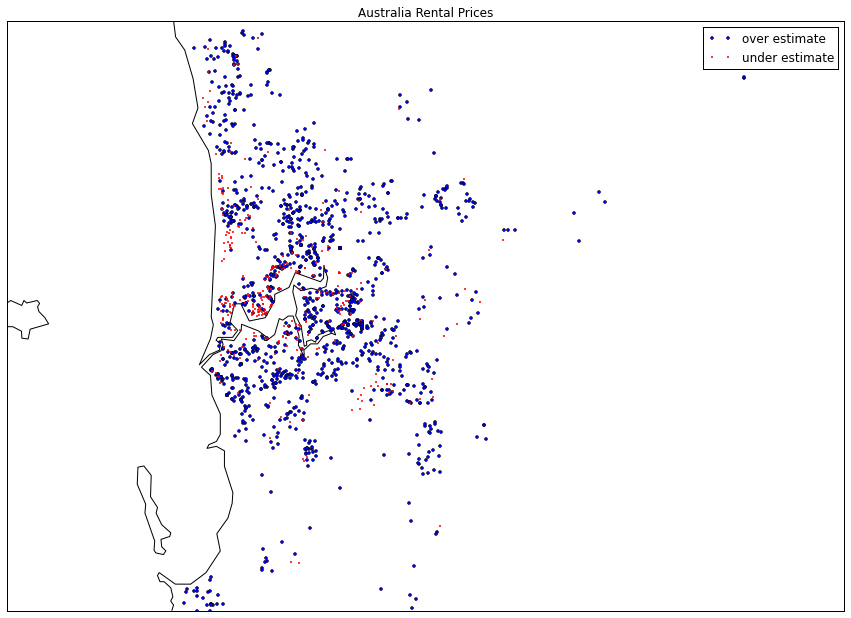

# <a href='https://www.kaggle.com/c/deloitte-western-australia-rental-prices'>Kaggle Deloitte Western Australia Rental Prices</a>

In this private masters competition I teamed up with <a
href='https://www.kaggle.com/ginotesei'>Gino Tesei</a> to wressle with
this large dataset. The data is no longer available and not sharable
per the terms, so these results are not reproducible, but with the
included files you can get an idea of how tackled this problem.

The data was best handled in SQL.  Extractions were then made to
prepare a training set, and the final model was an <a
href='australia-rental-prices-predict.ipynb'>ensemble blend</a> of R,
Python, XGB, and <a href='http://www.datarobot.com'>DataRobot</a>
generated models.

In the EDA phase I spent some time mapping out the rental locations
and actually looking at Google satellite data to identify outliers and
get a sense of the properties.

<b>Western Australia Rental Properties</b> 
 
Train (blue) and Test (red) locations 

Locations with price differentials 

